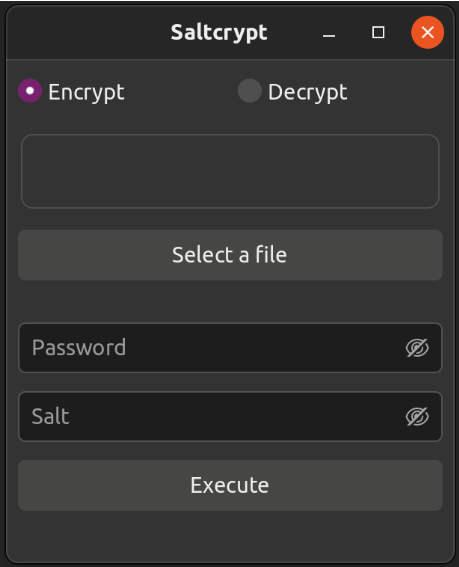

# Saltcrypt

Saltcrypt is a simple in-place file encryption tool using HKDF and AEAD.

Saltcrypt allows you to encrypt (and decrypt) your reasonably sized files. It's using Key Derivation Function with HMAC-256 (HKDF) to create strong hashes out of provided password and salt, but also name of the target file. Even if using same gredentials, created hashes are always unique for every file, which allows small safety measure: renamed encrypted files can't be opened anymore even with correct gredentials. Unless renamed back to original name.
ChaCha20 and Poly1305 based Authenticated Encryption with Associated Data (AEAD) cipher is used for the file encryption.